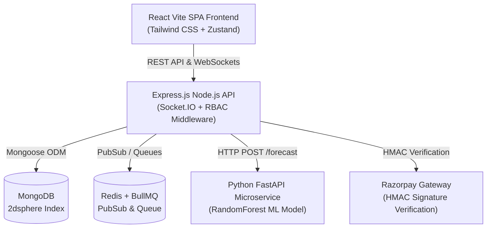
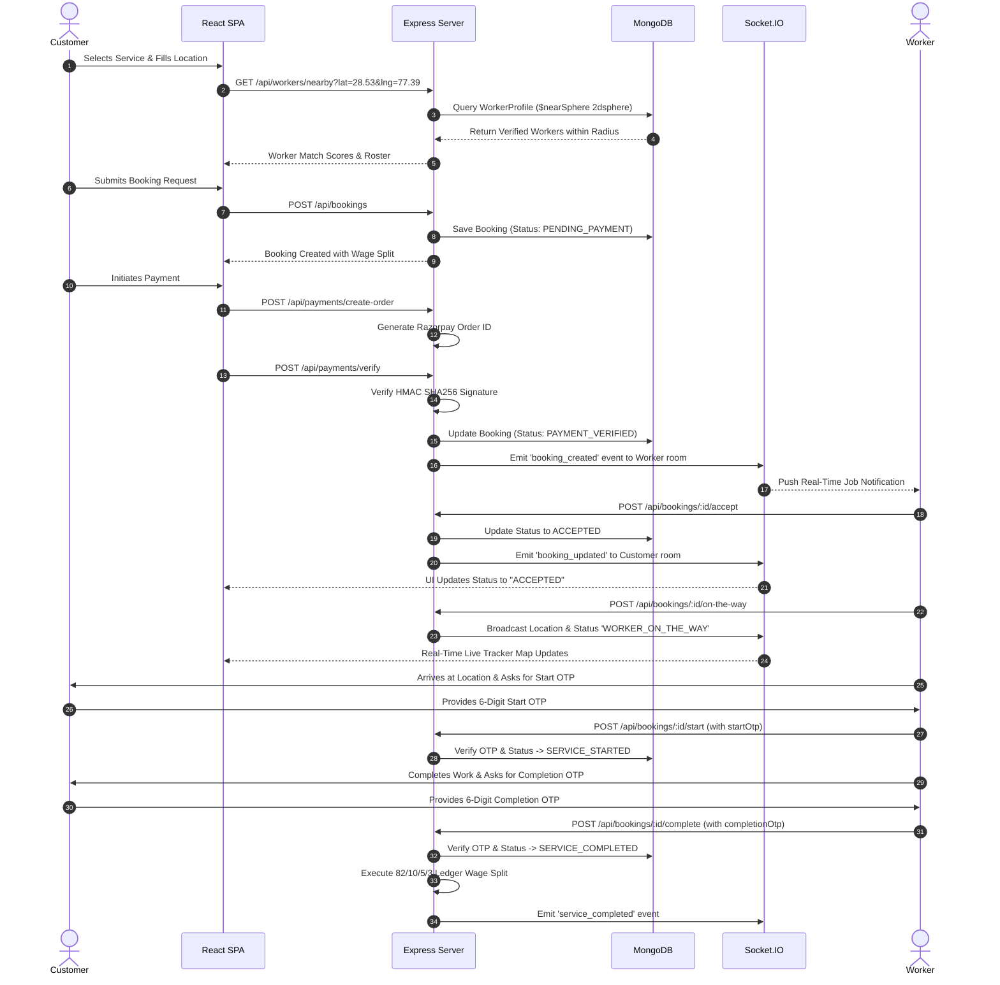
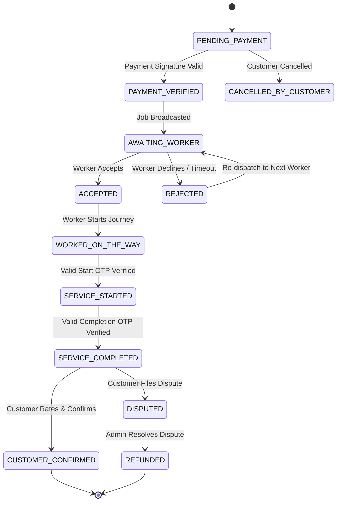

# Cooperative Labour Service Marketplace — End-to-End User & System Flow

This document provides a comprehensive breakdown of the application architecture, user journeys, state transitions, AI forecasting pipeline, and payment distribution model for the **Cooperative Labour Service Marketplace**.

---

## 1. System Topology & Architectural Flow



---

## 2. Customer Booking & Real-Time Tracking Flow



---

## 3. Booking State Machine Transitions

The platform strictly enforces valid booking state transitions to prevent race conditions and illegal workflow overrides:



---

## 4. Transparent 82/10/5/3 Wage Split Architecture

Every completed transaction automatically splits funds into four distinct ledgers to protect worker welfare:

| Share | Receiver | Description |
| :--- | :--- | :--- |
| **82%** | **Worker Bank Account** | Direct wage payout transferred immediately upon OTP verification. |
| **10%** | **Cooperative Welfare Fund** | Managed by local cooperative society for pension & emergency funds. |
| **5%** | **Worker Group Insurance** | Covers accidental injury and hospitalization insurance policy. |
| **3%** | **Platform Operations & Tech** | Server maintenance, SMS gateway, and cloud infrastructure costs. |

---

## 5. Machine Learning Demand Forecasting Pipeline

The Python FastAPI microservice leverages a `RandomForestRegressor` model to predict worker demand by location and time:

```
[ Historical Bookings & Weather Inputs ]
                  │
                  ▼
   [ Feature Engineering Pipeline ]
   ├── Day of Week (0-6)
   ├── Hour of Day (8-20)
   ├── Service Category Code (1-5)
   ├── Is Weekend (0 / 1)
   └── Monsoon / Weather Flag (0 / 1)
                  │
                  ▼
   [ Scikit-Learn RandomForestRegressor ]
                  │
                  ▼
[ Output: Predicted Demand + Feature Importance Explanation ]
```

---

## 6. User Roles & Page Navigation Map

### Customer Journey
1. **Landing Page (`/`)**: Highlighting verified workers, emergency banner, and wage transparency bar.
2. **Service Directory (`/services`)**: Search & filter by categories (Electrical, Plumbing, Carpentry, Cleaning).
3. **Booking Modal (5 Steps)**:
   - *Step 1*: Describe issue & select slot.
   - *Step 2*: Specify location (Geospatial 2dsphere).
   - *Step 3*: View matched verified workers.
   - *Step 4*: Inspect transparent price split & pay via Razorpay.
   - *Step 5*: Receive 6-digit OTPs.
4. **My Bookings (`/customer/bookings`)**: Live tracking with real-time Socket.IO status updates & rating modal.

### Worker Journey
1. **Worker Login (`/login`)**: Role-based authentication.
2. **Worker Dashboard (`/worker/dashboard`)**:
   - Availability toggle (Online / Offline).
   - Active job alerts with customer location.
   - OTP entry controls (Start OTP & Completion OTP).
   - Direct earnings ledger breakdown (82% earnings summary).

### Admin Journey
1. **Admin Login (`/login`)**: Role-based access control (SuperAdmin / SocietyAdmin).
2. **Admin Dashboard (`/admin/dashboard`)**:
   - Key Performance Indicators (Total Revenue, Active Workers, Completed Jobs).
   - Worker Verification Queue (Review Aadhaar/ITI certificates & Approve/Reject).
   - AI Demand Forecasting Chart (Visualized via Recharts).
   - Audit Log Ledger (Security logging of all administrative actions).
